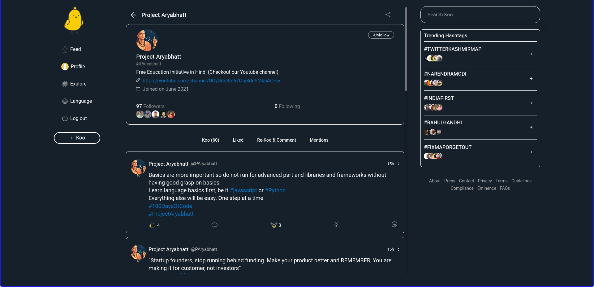

# Twitter-like-dark-theme-for-koo

You will need Stylus extension which is available on Firefox and Chrome and is a simple custom css loader.
This extension is recommended by the Firefox and it is also open-souce.

## Info on Stylus

* [GitHub link](https://github.com/openstyles/stylus)
* [FireFox Download link](https://addons.mozilla.org/en-US/firefox/addon/styl-us/?utm_source=addons.mozilla.org&utm_medium=referral&utm_content=search)
* [Chrome Download link](https://chrome.google.com/webstore/detail/stylus/clngdbkpkpeebahjckkjfobafhncgmne)

## On using Stylus

Go to the Stylus icon and click on the link of the website under "Write style for" which allows you to write a custom css for that domain and use the css code that you like.
Then paste the css of your wish in the css editor.
Then click override if any popup comes.

## Images

<b>Blue mode</b>

 
<b>Black mode</b>

